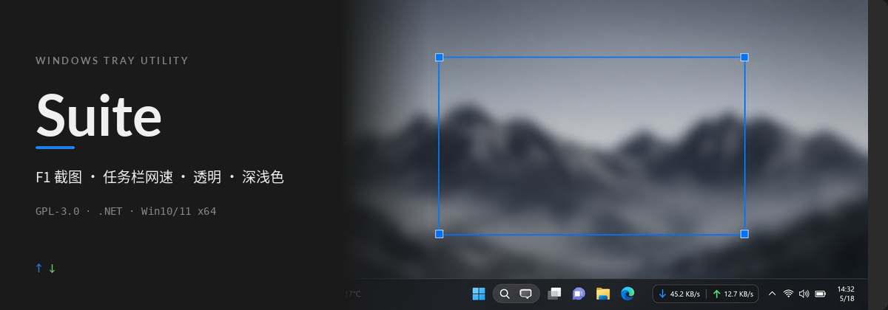

<p align="center">
  
</p>

<p align="center">
  <strong>一个托盘里搞定截图钉图、任务栏网速、透明和深浅色切换</strong>
</p>

<p align="center">
  <a href="LICENSE"></a>
  
  
</p>

**Suite** 是 Windows 单进程托盘工具（.NET / WPF，辅以少量 WinForms/GDI）。按 **F1** 截图，任务栏嵌入网速，可选任务栏透明与系统深浅色切换——不必为这些常见能力各装一个常驻程序。

---

## 功能

| 能力 | 说明 |
| --- | --- |
| **F1 截图** | 选区后出现 Snipaste 风格工具栏：复制 / 钉图 / 保存 |
| **选区交互** | 可移动选区、窗口吸附、蓝色选区框与角点锚 |
| **钉图** | 置顶覆盖层，彩虹描边高亮 |
| **任务栏网速** | TrafficMonitor 风格，GDI `UpdateLayeredWindow` **嵌入任务栏**（非仅悬浮窗交付形态） |
| **任务栏透明** | 改编自 TranslucentTB 的 TAP 路径；部分杀软可能拦截 `Tap.dll` |
| **深浅色** | 托盘菜单切换系统深色 / 浅色主题 |
| **设置** | 改完即应用、自动保存；含 OCR / 长截图相关实现路径 |

诚实边界：当前面向自用与开源协作；**不**声称已代码签名、上架商店、性能榜或用户量。

---

## 安装

1. 打开 [Releases](https://github.com/tsumon/suite/releases)，下载最新的 Suite 安装包。
2. 安装完成后从开始菜单或桌面快捷方式启动 **Suite**；托盘出现图标即表示常驻。
3. **便携版**：也可解压便携目录，直接运行 `Suite.exe`（勿拆散旁路 DLL）。布局约定见 [`installer/PORTABLE.md`](installer/PORTABLE.md)。

> 安装脚本骨架在 [`installer/`](installer/)（Inno Setup 草稿）。在目标 Windows 机器上用 Inno Setup 6 打开 `Suite.iss` 编译；仓库内**不保证**已预编译出安装包。

---

## 第一次使用

1. 运行 **Suite.exe**，确认系统托盘有 Suite 图标。
2. 按 **F1** 进入截图：拖出选区 → 用工具栏 **复制 / 钉图 / 保存**。
3. 右键托盘图标打开菜单：设置、深浅色切换、任务栏相关选项等。
4. 需要任务栏透明时，在设置中开启对应效果；若失败，先看下方杀软说明。

---

## 架构（一句话）

**单进程托盘宿主**：截图、钉图、网速、主题与任务栏效果同进程协作（含 Native / TAP 旁路 DLL），避免多开常驻。

---

## 杀软与 `Tap.dll`

任务栏透明走 **TAP**（`TaskbarFx.Tap.dll`，路径改编自 TranslucentTB）。部分杀毒 / EDR 会拦截或隔离该 DLL，导致透明效果不可用；截图与网速主路径通常仍可用，但仍取决于具体策略。

建议：

- 将 Suite 安装目录加入信任 / 排除（自行评估风险）
- 查看设置页中任务栏效果失败提示
- 发行说明中应写明可能被拦

---

## 从源码构建

需 Windows x64、.NET SDK（面向 .NET 10 / WPF 工程），并具备编译 Native / TAP 旁路 DLL 的 MSBuild 环境。

```powershell
# 托管主程序（示例）
dotnet publish src\Suite.App\Suite.App.csproj -c Release -p:Platform=x64 -r win-x64 --self-contained false

# 另编出 TaskbarFx.Native.dll / TaskbarFx.Tap.dll（MSBuild x64），
# 拷到 publish 输出目录，与 Suite.exe 旁路放置。
```

安装包：用 [Inno Setup 6](https://jrsoftware.org/isinfo.php) 打开 `installer/Suite.iss`，按脚本内 `Source` 路径指向你的 publish 输出后编译。细节见 [`installer/README.md`](installer/README.md)。

---

## 许可

**GPL-3.0**。见仓库根目录 [`LICENSE`](LICENSE) 与 [`NOTICE`](NOTICE)（含 TranslucentTB 改编路径等归属说明）。

---

## 资源

| 路径 | 用途 |
| --- | --- |
| [`assets/readme/hero.png`](assets/readme/hero.png) | README 发布用主视觉 |
| [`assets/readme/source/`](assets/readme/source/) | 可编辑源：`hero-layout.svg`、`hero-subject.png`、`hero-prompt.txt` |
| [`installer/`](installer/) | Inno 草稿与便携布局说明 |

计划仓库：[`tsumon/suite`](https://github.com/tsumon/suite)。
