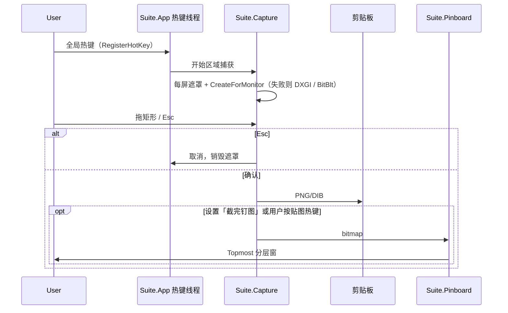
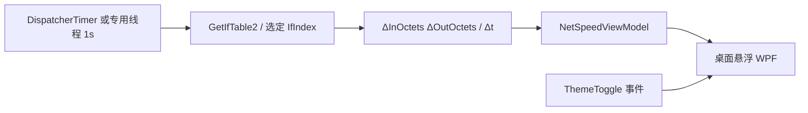
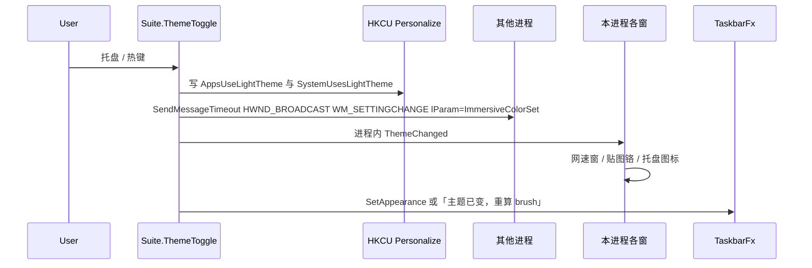
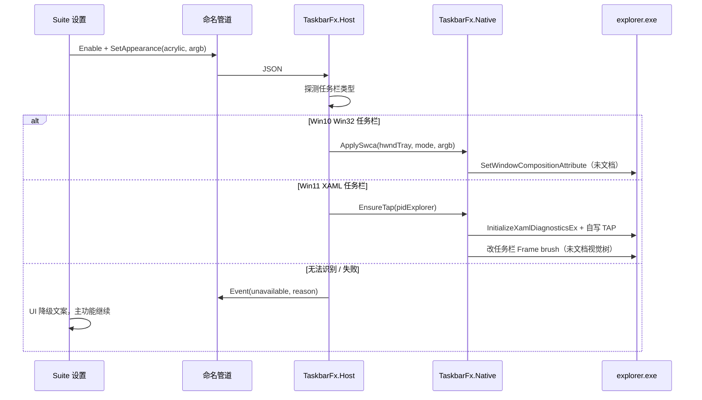

# Windows 合集 App 架构决策记录（ADR）

> **许可证变更（Joe 2026-09-05）：** 整包改为 **GPL-3.0** 开源，允许使用/改写 TranslucentTB。详见 `architecture/DECISION-GPL-TRANSLUCENTTB.md`。下文凡「闭源」「禁止拷 GPL」以新决定为准。


- **状态：** **已冻结（accepted）**。Joe 于 2026-09-05 在拟合app 对话确认：接受 ADR，按 Suite+TaskbarFx 与 P0/P1/P2 推进。
- **日期：** 2026-09-05（Asia/Shanghai）
- **作者：** 架构师（Grok Build）
- **不写：** 业务代码、视觉、面试材料、安全审计全文
- **决策者：** Joe（2026-09-05，拟合 app 对话拍板）
- **实现约定：** Grok Build 写，Joe 审

## 出处约定

| 标记 | 含义 |
| --- | --- |
| 调研 | `/workspace/windows-suite-app/research/REPORT.md`（2026-09-05） |
| 主题补丁 | `/workspace/windows-suite-app/research/ADDENDUM-theme.md`（2026-09-05） |
| 链接表 | `/workspace/windows-suite-app/research/SOURCES.md` |
| 拍板 | Joe 2026-09-05 拟合 app 对话（本任务给定，未再向 Joe 核实） |
| 外部事实 | 文内给链接与核对日 |
| **推断** | 无直接出处、由架构师根据上述材料推导 |

本 ADR **覆盖**调研报告 §4「任务栏亚克力：v1 不做」。覆盖原因是拍板第 1 条：v1 必须有任务栏透明/亚克力，并接受单独进程 + 注入 explorer。其余调研结论（双进程、闭源不拷 GPL/Anti-996、WPF 主路径、网速先做桌面窗）保持。

> **变更（Joe 2026-09-05）：** 任务栏透明改为与 Suite **同进程**（见 `architecture/DECISION-SINGLE-PROCESS.md`）。原「Suite + TaskbarFx 双进程」隔离策略被用户明确放弃。

工作名：合集 App。程序/程序集暂用 `Suite` / `TaskbarFx`。不在此拍品牌名。

---

## 0. 一页摘要

一个 **unpackaged 安装包**、两个进程：

```
Installer (EXE, 闭源, per-user)
 ├── Suite.exe          .NET 10 LTS + WPF：托盘、热键、截图、贴图、桌面网速、一键深浅色
 └── TaskbarFx.exe      C# 宿主 + 自写 native DLL：只负责任务栏外观；崩了不拖死截图
         └── TaskbarFx.Native.dll
               ├── Win10：对 Shell_TrayWnd 调未文档 SetWindowCompositionAttribute
               └── Win11：用文档化 InitializeXamlDiagnosticsEx 把自写 TAP DLL 载入 explorer，改 XAML 树
```

| 决策 | 选 | 不选 | 主要代价 |
| --- | --- | --- | --- |
| 进程 | 主进程 + TaskbarFx | 单进程塞注入 | 多一份 IPC 与启动顺序；换来崩溃隔离与杀软画像分离 |
| UI | WPF（贴图/悬浮/托盘） | WinUI 3 做贴图；Electron/Tauri；Python 交付 | 设置页不会是 WinUI 3 最新控件；换来分层窗成熟 |
| 运行时 | .NET 10 LTS，`net10.0-windows`，self-contained x64 | .NET 8（2026-11 到期）；.NET Framework 4.8 | 安装包变大；Win10 1903 官方 runtime 支持对不上（见 §2.4） |
| 安装 | unpackaged EXE | v1 MSIX / Store | 无包身份、无商店更新；才能做注入与 HKCU |
| 任务栏 | 自写双路径；v1 档位 Normal / Opaque / Clear / Acrylic | 拷 TranslucentTB；v1 做 Blur / 动态模式 | 每个 Windows 累计更新都可能打断 Win11 路径 |
| 网速 | 桌面悬浮窗 | v1 `SetParent` 进任务栏 | 不如「钉在任务栏」那么省桌面；避开 Win11 小组件死角 |
| 许可证 | 闭源；只学行为 + Microsoft 文档 API | 合入 GPL / Anti-996 源码 | 任务栏与截图必须自写，工期更长 |

---

## 1. 目标与非目标

### 1.1 质量场景（拍板 + 调研）

| ID | 场景 | 度量（v1 可验证） |
| --- | --- | --- |
| Q1 | 用户按全局热键，在多屏上框选区域，图进剪贴板，可再钉成置顶贴图 | 从热键到剪贴板 ≤ 用户可感（**推断**目标 &lt; 300 ms，不含 HDR 校正）；Esc 取消不留遮罩 |
| Q2 | 桌面始终能看到上/下行速率，不进任务栏 | 1 s 采样；选网卡；睡眠恢复后数字不为恒 0（对标 TrafficMonitor V1.86 修过的坑，调研 §2.3） |
| Q3 | 托盘一键翻转系统 Apps+System 浅深色，本 App 窗立刻换色 | 写 HKCU 两 DWORD + `ImmersiveColorSet` 广播；不以杀 explorer 为默认路径（主题补丁 §2.1） |
| Q4 | 任务栏可在 Opaque / Clear / Acrylic 间切换；关效果能回到系统默认 | Win10 与 Win11 **两条实现**；失败则明确降级，不静默假成功 |
| Q5 | TaskbarFx 或注入失败时，截图/贴图/网速仍可用 | 主进程不加载 explorer 注入代码 |

### 1.2 v1 In

来源：拍板 1–7 + 调研 §4 建议切片 + 主题补丁 §4。标注能力按调研「四件套」收口，不是 Snipaste Pro。

| 能力 | v1 要做到 | 刻意不做（仍算同一产品线） |
| --- | --- | --- |
| 截图 | 区域框选、全屏遮罩、Esc、复制、存 PNG、全局热键 | OCR、滚动长截、GIF、Super-snip、命令行矩阵 |
| 标注 | 矩形、箭头、文字、马赛克 | 高斯模糊全套、编号、双向箭头 |
| 贴图 | 截完或剪贴板钉窗；拖动、滚轮缩放、透明度、关闭、鼠标穿透 | 分组、自动备份恢复、GIF、虚拟桌面贴图 |
| 网速 | 桌面悬浮：上/下行、置顶、可拖、选网卡 | 任务栏嵌入、CPU/GPU/温度、皮肤引擎、WinRing0 |
| 主题 | 托盘/热键同时翻 `AppsUseLightTheme` + `SystemUsesLightTheme` + 广播；刷新本 App 配色 | 日出日落自动、整包 `.theme`、壁纸随主题 |
| 任务栏 | 自写；Win10 Win32 / Win11 XAML 分路径；档位见 §5.2 | 动态模式（有窗/最大化/开始菜单…）、Peek 按钮、Win11 底线开关、与 RoundedTB/ExplorerPatcher 联调 |
| 壳 | 托盘常驻、单实例、可选开机启动、统一设置 | 商店上架、便携 zip 作为主交付（可作 P2 旁路） |

最低 OS：**产品意图** Windows 10 1903（build 18362，Graphics Capture 下限）+ Windows 11。**合同支持面**见 §2.4，与 .NET 10 官方矩阵不完全重合。

### 1.3 v1 Out

- 抄 TranslucentTB / ShareX / Flameshot / Greenshot / Auto Dark Mode（皆 GPL-3.0）源码进闭源树。出处：调研 §1、§5；Auto Dark Mode 见主题补丁 §2.3（9677 stars，GPL-3.0，`gh api` 2026-09-05）。
- 抄 TrafficMonitor（Anti-996，SPDX `NOASSERTION`）源码。出处：调研 §2.3。
- 逆向 Snipaste。EULA 禁止修改/反编译（[eula.html](https://www.snipaste.com/eula.html)，页内 Last updated 2024/07/10，调研核对 2026-09-05）。
- 依赖 ExplorerPatcher / RoundedTB（后者已 archived，调研 §5）。
- 硬件监控驱动、管理员权限作为默认运行方式。
- Electron / Tauri / Python 作为发布形态（调研 §3 C 与附录）。
- Win7 / 跨平台。
- 完整安全审计、威胁模型正文（只列触点，交「安全审计」）。

### 1.4 约束登记（拍板 = required；调研建议 = 被覆盖或采纳）

| ID | 种类 | 内容 | 处置 |
| --- | --- | --- | --- |
| C1 | required | v1 必须任务栏透明/亚克力；接受单独进程 + 注入 explorer | 采纳。覆盖调研「v1 不做」 |
| C2 | required | 闭源安装包；不拷 GPL / Anti-996 代码；可学行为与 Microsoft 文档 API | 采纳。实现与评审红线 |
| C3 | required | 最低 Win10 1903+，支持 Win11；任务栏必须 Win10 Win32 / Win11 XAML 两套 | 采纳意图；**与 C6 冲突**，见 §2.4 |
| C4 | required | 网速以桌面悬浮为主；任务栏嵌入可选、可 v1.x | 采纳。v1 不做 `SetParent` |
| C5 | required | 一键系统深浅色：HKCU 两键 + `ImmersiveColorSet` | 采纳 |
| C6 | required | C# + .NET LTS + WPF；Grok Build 写、Joe 审 | 采纳。LTS 钉 .NET 10，见 §2.4 |
| C7 | prohibited | 把注入逻辑放进 Suite UI 线程 / 与截图同进程 | 采纳调研附录进程图 |
| C8 | preferred | 无管理员、无内核驱动 | 采纳。注入当前用户 explorer 通常不需要提权（**推断**，需安全审计复核） |

---

## 2. 进程与部署模型

### 2.1 为什么两个进程（覆盖「一个进程做完」）

**选：Suite.exe + TaskbarFx.exe。**

调研 §1：截图/贴图/桌面网速可以同进程；任务栏亚克力要对 `explorer.exe` 注入或挂钩，「崩溃会拖垮整套工具，杀软画像也完全不同」。TranslucentTB 2026.2 仍用 ExplorerTAP 注入 explorer，仓库 topics 含 `undocumented`（[README](https://github.com/TranslucentTB/TranslucentTB)，核对 2026-09-05；[Release 2026.2](https://github.com/TranslucentTB/TranslucentTB/releases/tag/2026.2) 发布 2026-08-31）。

**不选：**

| 方案 | 为什么不选 |
| --- | --- |
| 单进程内 P/Invoke + 注入 | 注入 DLL 崩 = 截图热键一起死；杀软对「截图工具」和「注入 explorer」签名完全不同 |
| TaskbarFx 做成 Windows 服务 | 服务在会话 0，碰不到用户 explorer |
| 三个以上进程（截图再拆） | v1 无独立崩溃证据值得再拆；热键与贴图必须同会话 UI |

**贸易代价：** 要写 IPC、启动/退出协议、设置双写（主进程为源）。换来：Q5 隔离；TaskbarFx 可单独关；安全审计可以只深挖注入进程。

**崩溃隔离（必须写进实现约束，不是愿望）：**

| 谁崩 | 期望 | 不期望 |
| --- | --- | --- |
| Suite.exe | 贴图/热键没了；TaskbarFx 保持最后一次外观，或按超时回到 Normal（设置项，默认 **保持外观**，避免任务栏闪） | 顺带卸载已注入 DLL（做不到可靠，且可能更危险） |
| TaskbarFx.exe 宿主 | Suite 标「任务栏效果不可用」，可一键拉起；截图不受影响 | 主进程跟着退 |
| 已注入的 native DLL / explorer | **这是接受的风险。** explorer 重启后任务栏暂时消失再回来；Suite 不得在注入路径上 `abort` 自己 | 用 SEH 包一切就当安全——不够，交安全审计 |

注入代码 **禁止** CLR 进 `explorer.exe`（**推断**：多运行时版本冲突、GC 停顿打在 Shell 上）。因此 in-explorer 模块必须是 **native C++**，不是 C# 类库被 TAP 拉进 explorer。RainbowTaskbar 等 C# 注入存在，不作本产品路径。

### 2.2 IPC：命名管道

**选：同一用户会话内的命名管道（`System.IO.Pipes`），消息 = 长度前缀 + UTF-8 JSON。**

管道名（示意，实现可加随机后缀+发现）：`\\.\pipe\Suite-TaskbarFx`。ACL：**仅当前用户 SID** 可连接，拒绝 Everyone / World。连接方必须是已启动的 Suite 或本机调试器（调试用显式开关）。

协议最小集（v1）：

| 方向 | 消息 | 语义 |
| --- | --- | --- |
| Suite → Fx | `Enable` / `Disable` | 开/关效果；Disable = 回到系统默认（Normal） |
| Suite → Fx | `SetAppearance { mode, argb }` | mode ∈ {normal, opaque, clear, acrylic} |
| Suite → Fx | `GetStatus` | OS 路径（win10-swca / win11-xaml / unavailable）、最后错误 |
| Suite → Fx | `Shutdown` | 宿主退出；尽量 Disable 再退 |
| Fx → Suite | `Event { kind, detail }` | explorer 重启探测、降级、注入失败 |
| 双向 | `Ping` | 心跳；Suite 为 client，Fx 为 server |

动态模式（有可见窗 / 最大化 / 开始菜单…）**不是 v1 消息**。设置 schema 可留空字段，避免以后改 IPC 版本。拍板未要求动态模式；调研 §2.2 写明「不是 MVP 必须」。

**不选：**

| 方案 | 为什么不选 |
| --- | --- |
| localhost TCP / gRPC | 无意义扩大网络面；gRPC 多依赖，Grok+Joe 审成本高 |
| `WM_COPYDATA` | 绑 HWND 生命周期；TaskbarFx 无窗或托盘窗重建即断 |
| 内存映射文件 | 还要另做同步对象，等于自研管道 |
| COM 本地服务器 | 注册表、套间、调试更重；v1 消息面很小 |
| 标准输入输出 | 宿主被外部拉起或重启时易断；也不好做 ACL |

**贸易代价：** JSON 比二进制啰嗦，但 payload 是色值与枚举，可忽略。管道在 explorer 忙时可能卡住——**所有调用必须超时**（建议 2 s，**推断**），超时 = 降级，不许阻塞截图热键线程。

**进程关系：**

- Suite 是设置的唯一写入者（`%LOCALAPPDATA%\Suite\settings.json`）。
- 用户打开「任务栏效果」→ Suite 若发现管道不在则 `CreateProcess` 拉起 TaskbarFx（同目录、同完整度、不提权）。
- TaskbarFx 不读第二份互相冲突的 ini；只读 Suite 推送的快照 + 只读探测 OS。
- 单实例：Suite 用命名 Mutex；TaskbarFx 用另一 Mutex。禁止两套注入同时活。

### 2.3 安装包：unpackaged，不选 v1 MSIX

**选：per-user unpackaged 安装包**（Inno Setup 或 WiX 二选一，实现阶段定工具；架构只定形态）。发布 `Suite.exe` + `TaskbarFx.exe` + native DLL + .NET **self-contained** 负载。开机启动写 `HKCU\...\Run` 或登录计划任务（企业策略可能禁启动任务，TranslucentTB README 有同类说明，调研 §2.2）。

官方对照：unpackaged **无 package identity**，但「file system / registry / elevation / process model 不受限」。出处：[Packaging overview](https://learn.microsoft.com/en-us/windows/apps/package-and-deploy/packaging/)（页内 2026-08-29，本 ADR 核对 2026-09-05）。部署 unpackaged 使用 WASDK 的指南：[Deploy unpackaged apps](https://learn.microsoft.com/en-us/windows/apps/windows-app-sdk/deploy-unpackaged-apps)（调研引用，页内 ms.date 2026-05-29）。

本产品 v1 **尽量不依赖 Windows App SDK**（WPF + CsWinRT 调 `Windows.Graphics.Capture` 即可）。避免再背一层框架包。若某 WinRT API 强制包身份，该能力降级，而不是为了它改 MSIX。

**不选 v1 MSIX / Store：**

- 注入 explorer、向用户 Session 的 `explorer.exe` 加载自写 DLL、写 HKCU 主题、全局热键，与 AppContainer / 注册表虚拟化 / 包身份模型相逆。Microsoft 自己也写：MSIX 下 Shell 扩展注册表被虚拟化（[Integrate packaged desktop app with File Explorer](https://learn.microsoft.com/en-us/windows/apps/desktop/modernize/integrate-packaged-app-with-file-explorer)）。
- 拍板是闭源安装包，不是商店。TranslucentTB 能上 Store 是因为它开源 + 自己处理身份；不能当闭源注入工具的模板。
- MSIX 自动更新、通知、后台任务对本 v1 无刚需。

**贸易代价：**

- 无 SmartScreen 声誉积累则「Windows 已保护你的电脑」（Snipaste 中文故障排除同样遇到未签名，调研 §2.1）。必须走代码签名，见 §5.4。
- 无应用内自动更新。v1 可接受「下一个安装包覆盖」；P2 再谈。
- self-contained 体积大约数十 MB 级（**推断**，视裁剪而定），比框架依赖包大。换来目标机不必先装 .NET 10 Desktop Runtime。

**不选 ClickOnce**（企业与杀软体验差、更新模型老）。**不选便携 zip 作主通道**（注入 DLL 路径、开机启动、卸载清理都不干净）。P2 可加「解压即用」仅 Win11——TranslucentTB 便携版也只宣称 Win11（调研 §2.2），本产品不在 v1 承诺。

### 2.4 运行时：.NET 10 LTS，以及和「Win10 1903」的冲突

拍板：.NET LTS。2026-09-05 官方生命周期：

| 版本 | 类型 | 结束支持 |
| --- | --- | --- |
| .NET 10 | LTS | 2028-11-15 |
| .NET 9 | STS | 2026-11-11 |
| .NET 8 | LTS | 2026-11-11 |

出处：[Microsoft .NET lifecycle](https://learn.microsoft.com/en-us/lifecycle/products/microsoft-net-and-net-core)（页内更新 2026-08-19，本 ADR 核对 2026-09-05）；[releases-and-support](https://learn.microsoft.com/zh-tw/dotnet/core/releases-and-support) 写明 .NET 10 为长期支持至 2028-11。

**选 .NET 10（`net10.0-windows`，WPF）。不选 .NET 8：** 距结束支持约两个月，新仓库不应落地即过期。

**与 C3 的冲突（必须写明，不能装没看见）：**

[.NET 在 Windows 上的安装/支持表](https://learn.microsoft.com/en-us/dotnet/core/install/windows)（页内 2026-08-24，本 ADR 核对 2026-09-05）：

- .NET 10 列出的 Windows 10 是 **21H2、1809、1607 的 LTSC/Enterprise**。
- 文内写：**Windows 10 支持限于 LTSC 与 Enterprise**。
- 消费者 Windows 10 22H2 主流支持已于 2025-10-14 结束（[Lifecycle FAQ - Windows](https://learn.microsoft.com/en-us/lifecycle/faq/windows)）。
- Windows 10 1903 Home/Pro 支持早已结束（2019 年功能更新，EOS 远早于本 ADR）。

因此：**「1903+ 且 .NET 10 LTS」在 Microsoft 合同意义上不成立。** 1903 的真实含义是 **Graphics Capture API 下限**（[CreateForMonitor](https://learn.microsoft.com/en-us/windows/win32/api/windows.graphics.capture.interop/nf-windows-graphics-capture-interop-igraphicscaptureiteminterop-createformonitor)：Window 10 Version 1903 Build 18362），不是「我们保证在 1903 家庭版上签支持合同」。

**处置（仍遵守拍板意图）：**

| 层 | 规定 |
| --- | --- |
| API / 代码 | 不把 1903 之后才有的捕获 API 当成唯一路径；主路径仍是 `IGraphicsCaptureItemInterop.CreateForMonitor` |
| 安装程序 | build &lt; 18362 **拒绝安装**；18362–19043（约 21H1 前）**警告「超出 .NET 10 官方 OS 矩阵，best-effort」**后可继续（文案实现时再写） |
| QA 合同机 | **Windows 11 当前功能更新** + **Windows 10 22H2**（OS 本身已 EOL，只作回归锚） |
| 不选 | 为了字面 1903 退回 .NET Framework 4.8（丢失现代 WinRT 投影与 LTS）；不选只支持 Win11（违反 C3） |

开发工具：目标 `net10.0` 需要 Visual Studio 2026 / MSBuild 18.0+（[Version requirements for .NET 10 SDK](https://learn.microsoft.com/en-us/dotnet/core/compatibility/sdk/10.0/version-requirements)）。Grok Build 在 Debian 上 **不能** 真机编译 WPF；编码在远程，**构建与 UI 验证必须在 Joe 的 Windows 机**（TEAM.md：Windows tsumon）。本 ADR 把「谁编译」定为：远程出代码，Windows 出 bin。

架构：**x64 v1 必须**；ARM64 放到 P2（Snipaste 2.11 已有 ARM64，调研 §2.1，不是我们 v1 范围）。

---

## 3. 模块边界

### 3.1 项目切分（建议，尚不建 GitHub）

每个功能一个类库，**禁止** 贴图窗去 `new` 网速采样器，**禁止** 截图模块链接 TaskbarFx.Native。

| 项目 | 形态 | 职责 | 允许依赖 |
| --- | --- | --- | --- |
| `Suite.Contracts` | 纯托管 classlib | IPC DTO、设置 schema、功能开关枚举 | 无 UI、无 P/Invoke |
| `Suite.Platform` | 托管 + P/Invoke | OS 版本、任务栏类型探测、注册表、`SendMessageTimeout`、热键、剪贴板、单实例 | Contracts |
| `Suite.Capture` | 托管 + WinRT/DX | 选区遮罩逻辑、帧捕获、标注到 bitmap | Platform |
| `Suite.Pinboard` | 纯 WPF | 置顶分层贴图窗 | Platform（DPI/主题色） |
| `Suite.NetSpeed` | 托管 + `Iphlpapi` | 采样、网卡选择、速率计算 | Platform |
| `Suite.ThemeToggle` | 托管 + 注册表 | 读-翻-写-广播；本进程主题变更事件 | Platform |
| `Suite.App` | WPF exe（TrayShell） | 托盘、设置窗、热键路由、拉起 TaskbarFx、生命周期 | 以上全部 **除 Native** |
| `TaskbarFx.Host` | C# exe | 管道服务端、把外观命令交给 Native、explorer 重启重注 | Contracts、Platform（只读探测） |
| `TaskbarFx.Native` | C++ DLL | Win10 SWCA；Win11 TAP + 自写 visual 修改 | **零托管**；不链 WPF |

测试项目按库配：`Suite.NetSpeed.Tests`、`Suite.ThemeToggle.Tests` 可在无 UI 下跑。Capture/Pinboard/Native 以 Windows 真机手工脚本为主（远程 Debian 无桌面）。

### 3.2 哪些必须 native / PInvoke / 纯托管

| 模块 | 纯托管 | C# P/Invoke 或 CsWinRT | 必须 native C++ |
| --- | --- | --- | --- |
| TrayShell | WPF 托盘与设置 | `RegisterHotKey` / `NotifyIcon`（或 WPF Tray 库，但不要 NuGet 来路不明） | 否 |
| Capture | 选区状态机、标注绘制（WPF/`WriteableBitmap`） | `Windows.Graphics.Capture`、`IGraphicsCaptureItemInterop`、DXGI Duplication、GDI `BitBlt` 回退 | 否（v1） |
| Pinboard | WPF `Topmost` + `AllowsTransparency` | 穿透：`WS_EX_TRANSPARENT` / `WS_EX_LAYERED` 如 WPF 不够再 P/Invoke | 否 |
| NetSpeed | 计算与 VM | `GetIfTable2` / `GetIfEntry2`（[文档](https://learn.microsoft.com/en-us/windows/win32/api/netioapi/nf-netioapi-getiftable2)） | 否 |
| ThemeToggle | 编排 | `Microsoft.Win32.Registry` + `SendMessageTimeoutW` | 否 |
| TaskbarFx 宿主 | 管道、策略、重试 | `FindWindow`、进程 ID、等待 explorer | 否 |
| TaskbarFx 效果 | — | **禁止** 在 C# 里对 explorer 做 TAP | **是**：注入点、SWCA、XAML 树改 brush |

**不选** 把 SWCA 只写在 C# `DllImport` 里当 Win11 方案：Win11 现代任务栏上 TranslucentTB 2026.2 明确 **Avoid ExplorerHooks**，改走 TAP（调研 §2.2）。C# 调 SWCA 只作为 **Win10 路径的备选实现**；为保持一份 native、两边行为一致，**Win10 也放进 Native DLL**（Host 只传 mode/argb）。

**不选** CsWinRT 去刷系统任务栏 AcrylicBrush：任务栏不是本进程窗口（调研 §2.2：「没有证据表明它用公开 WinUI AcrylicBrush 去刷系统任务栏」）。

### 3.3 捕获 API 顺序（模块内策略，不是产品功能）

调研 §4 推荐，本 ADR 固化：

1. **主：`IGraphicsCaptureItemInterop.CreateForMonitor`** — Win10 1903+，静默，无系统黄框。官方：[CreateForMonitor](https://learn.microsoft.com/en-us/windows/win32/api/windows.graphics.capture.interop/nf-windows-graphics-capture-interop-igraphicscaptureiteminterop-createformonitor)；WPF 示例存在于 [Windows.UI.Composition-Win32-Samples](https://github.com/microsoft/Windows.UI.Composition-Win32-Samples)（要求 1903+）。
2. **次：DXGI Desktop Duplication** — 连续帧/HDR 相关。[Desktop Duplication API](https://learn.microsoft.com/en-us/windows/win32/direct3ddxgi/desktop-dup-api)（页内 updated 2025-04-15）。
3. **底：GDI `BitBlt`** — HDR 过曝已知；Snipaste 旁路仓 [bitblt-hdr](https://github.com/Snipaste/bitblt-hdr)（MIT）说明问题本身，**不要**把 BitBlt 当 HDR 方案。

受 `SetWindowDisplayAffinity` 保护的窗、部分 DirectX 全屏：允许黑块，v1 不承诺「网课防截破除」（调研 §2.1 坑表）。

Picker（`GraphicsCapturePicker`）**不作为区域截图主 UX**：会出系统 UI，不像 Snipaste。可留作调试。

### 3.4 贴图为什么 WPF 而不是 WinUI 3

调研 §3 A：WPF 贴图高；WinUI 3 透明分层窗有已知坑（[castorix/WinUI3_SwapChainPanel_Layered](https://github.com/castorix/WinUI3_SwapChainPanel_Layered)，非正式，59 stars）。拍板已钉 WPF。设置页也用 WPF，**v1 不引入 WinUI 3 双 UI 栈**。

代价：Fluent 控件不是默认外观。视觉交 design，不在本 ADR。

### 3.5 许可证隔离墙

- 评审清单：PR 不得出现从 GPL/Anti-996 仓复制的函数、头文件、资源。
- 对照行为时用 Microsoft Learn + 本 ADR 描述的公开 API。
- ShareX 是最接近的开源贴图对照（GPL-3.0，调研 §5），**只允许看文档** [Pin to screen](https://getsharex.com/docs/pin-to-screen.html)，不允许把源码贴进仓库或 ADR。
- Grok 生成代码若「长得像」TranslucentTB，Joe 审时按闭源污染处理：弃用重写。

---

## 4. 关键数据流

### 4.1 热键 → 截图 → 剪贴板 / 贴图



约束：热键回调 **不得** 等 TaskbarFx 管道。与系统「PrtScr 打开截图工具」冲突时，设置页提示去关闭系统开关（ShareX 踩过，调研 §4；issue 见 SOURCES.md `ShareX/ShareX/issues/7847`）。

### 4.2 网速采样 → UI



- 采样不进 UI 线程做系统调用阻塞（**推断** 好实践；`GetIfTable2` 通常很快）。
- 网卡「一直 0」：提供手动选接口 + 刷新（TrafficMonitor FAQ，调研 §2.3）。
- **v1 没有** `FindWindow("Shell_TrayWnd")` + `SetParent`。该路径是 v1.x 可选，且 Win11 占满/小组件是已知死角（Help.md，调研 §2.3）。

### 4.3 主题切换 → 广播 → 各窗刷新

来源：主题补丁 §2.1、§5。无微软「ToggleSystemColorMode」公开 API（主题补丁 §2.4）。



- **默认不杀 explorer。**
- 超时建议 ~5 s、`SMTO_ABORTIFHUNG`（主题补丁草图）。
- 与 Auto Dark Mode 互斥：设置页一句警告即可，v1 不做文件锁。
- `IThemeManager2` / 整包 `.theme`：v1 Out（未文档 COM，主题补丁 §2.2）。

### 4.4 主进程 ↔ TaskbarFx



explorer 被用户或系统拉起后：Host 侦测 `Shell_TrayWnd` 丢失/重建，**自动重注**（有上限，避免崩溃循环）。重入是 TranslucentTB 2026.2 修过的类问题（调研 §2.2），本产品必须自写重试预算，例如 5 次/30 s 后停并报错（**推断**数值）。

---

## 5. Win10 vs Win11 任务栏策略（自写，不拷 GPL）

### 5.1 探测：按窗结构，不按「是不是 Win11」一刀切

**选：** 同时看 build 与 HWND 树。

- 经典 Win32 任务栏：`Shell_TrayWnd` 下 **没有** `Windows.UI.Composition.DesktopWindowContentBridge`（TrafficMonitor 用此判断 Win11 任务栏，调研 §2.3；**只学行为，不拷其 MFC 代码**）。
- 现代 XAML 任务栏：存在该桥接类。TranslucentTB 侧还有 22621+ / 无 `WorkerW` 等注释（调研 §2.2，二次来源，**以真机探测为准**）。
- 用户装 ExplorerPatcher 可能在 Win11 上回到类 Win10 任务栏 → 走 SWCA 路径。合集 **不** 把 ExplorerPatcher 当依赖，只是探测结果可能落到 Win10 策略。

副屏：`Shell_SecondaryTrayWnd`。v1 目标是 **所有本地任务栏**；单屏失败则该屏降级，其它屏继续（TranslucentTB 2026.2 修过「某些显示器无法更新」，调研 §2.2）。

### 5.2 v1 最低可用档位

对标 TranslucentTB README 的 Normal / Opaque / Clear / Blur / Acrylic（调研 §2.2），**v1 只承诺四档**：

| 档位 | 含义 | Win10（SWCA 路径） | Win11（XAML TAP 路径） | v1 承诺 |
| --- | --- | --- | --- | --- |
| Normal | 不改系统 | 不调用或恢复默认 | 卸 brush / 不注入 | 必须 |
| Opaque | 实色 + 用户 ARGB | 主路径 | TAP 改背景 | 必须 |
| Clear | 全透明（或 alpha=0） | 主路径 | TAP | 必须 |
| Acrylic | Fluent 磨砂 | SWCA 的 acrylic accent（未文档，可能随版本变） | 自写 composition brush，**不是** 公开 WinUI AcrylicBrush 刷别人的窗 | 必须；失败 → 降到 Opaque 并告诉用户 |
| Blur | 旧模糊 | TranslucentTB：仅 Win10 与 Win11 build 22000 | 现代 Win11 OS 已拿掉 | **v1 Out** |
| 动态模式 | 按开始菜单/最大化切换档位 | — | — | **v1 Out**（v1.x） |

取色器 + 实时预览：v1 设置页给 ARGB 与即时 Apply 即可，不必做 TranslucentTB 级取色器。

### 5.3 两条实现（公开 API vs 未文档）——只描述职责，不给可抄片段

**路径 A — Win10 Win32**

- 职责：找到任务栏 HWND，对其设置 composition / accent。
- 公开侧：`FindWindow` / `FindWindowEx`（文档化）。
- 未文档侧：`user32!SetWindowCompositionAttribute`（`GetProcAddress`）。社区与 Microsoft Q&A 承认 TranslucentTB 走这条路：[learn.microsoft.com Q&A](https://learn.microsoft.com/en-us/answers/questions/1720291/taskbar-shell-traywnd-transparency-like-in-translu)（提问 2024-06-20，调研核对 2026-09-05）。sylveon 在 [WindowsAppSDK discussion #2711](https://github.com/microsoft/WindowsAppSDK/discussions/2711) 写过：这是未文档技巧，曾被更新弄坏又修好。
- **降级：** 导出不存在 / HRESULT 失败 / 看起来没变 → `GetStatus.unavailable`，UI 给「当前系统不支持不透明/透明/亚克力」，主程序继续。
- **禁止：** 把 GPL 仓的 `undoc/*.hpp`、detour 文件拷进 `TaskbarFx.Native`。结构体自己按公开讨论实现，并在代码注明「未文档，可能断裂」。

**路径 B — Win11 XAML**

- 加载手段用 **文档化** API：[`InitializeXamlDiagnosticsEx`](https://learn.microsoft.com/en-us/windows/win32/api/xamlom/nf-xamlom-initializexamldiagnosticsex)（`xamlom.h`，最低客户端 Windows 10 1703）。文档原话：这是 XAML 诊断/调试工具的入口，会按 CLSID 把实现了 `IObjectWithSite` 的 DLL 载入目标 PID。
- **用途是 off-label：** 目标 PID 是 `explorer.exe`，不是 Visual Studio 正在调试的 App。这是风险点，不是 GPL 泄漏点。
- 载入之后改哪些 XAML 节点、什么 brush：**系统任务栏视觉树未文档**，随 build 改名即挂。自写 watcher + 失败回退；**不拷** TranslucentTB `ExplorerTAP/`、`XamlBlurBrush`、`VisualTreeWatcher`。
- 2026.2 经验：现代 XAML 任务栏上避免 ExplorerHooks（调研 §2.2）。本产品 v1 **不做** IAT/detour 钩 `SetWindowCompositionAttribute` 的 Win11 路径。
- **降级：** `InitializeXamlDiagnosticsEx` 失败、TAP 未就绪超时、找不到预期视觉节点 → 不重试死循环；Host 报 `unavailable`；可选提示「已用实色」若 Opaque 仍能走 SWCA（很多 Win11 上 SWCA 对 XAML 任务栏无效，**推断**，必须以探测为准）。

**Win11 累计更新额外风险：** 2025-07 之后部分企业机 XAML 包注册时序导致 explorer/任务栏起不来（[KB5072911](https://support.microsoft.com/en-us/servicing/os/windows/docs/2025/11/kb5072911-explorer-the-start-menu-and-other-xaml-dependent-apps-might-not-start-or-close-unexpectedl)，页面记载至 2026-06-23 修复滚动)。注入应避开 explorer 初始化窗口期（**推断**：等 `Shell_TrayWnd` 稳定再 TAP）。

### 5.4 杀软 / 签名 — 触点清单（正文交安全审计）

下列只列触点，不写利用细节、不写 PoC。

| ID | 触点 | 为什么会出现 | 建议交给安全审计的问题 |
| --- | --- | --- | --- |
| S1 | 向 `explorer.exe` 加载自写 DLL | TAP / 诊断 API off-label | 行为是否像注入型 PE；如何写清「预期行为」给 Defender 排除 |
| S2 | Authenticode 与 SmartScreen | unpackaged + 未建立声誉 | OV vs EV vs Azure Trusted Signing（[Packaging overview](https://learn.microsoft.com/en-us/windows/apps/package-and-deploy/packaging/) 提到 Trusted Signing）；DLL 与 EXE 是否同一证书 |
| S3 | 命名管道 ACL | 本机会话 IPC | 是否会被同用户恶意进程指挥任务栏/注入 |
| S4 | HKCU Run / 计划任务 | 托盘常驻 | 持久化画像；卸载是否删干净 |
| S5 | 截图 API | 屏幕内容 | 保护窗、企业 DLP、录屏策略 |
| S6 | 主题注册表 | 写 HKCU Personalize | 企业 MDM 锁主题后的失败模式（主题补丁 §6.4 未测） |
| S7 | 热键 | `RegisterHotKey` | 抢系统/其它工具热键 |
| S8 | 供应链 | 闭源安装包、Grok 生成代码 | 构建机、依赖锁定、无 GPL 污染扫描 |

TranslucentTB README Security：「Some antiviruses are over eager」（调研 §2.2）。TrafficMonitor 的 WinRing0 被 Defender 报驱动（[#2331](https://github.com/zhongyang219/TrafficMonitor/issues/2331)）——**本产品不带任何驱动**，避免这条画像。

v1 签名策略（架构级，不是审计结论）：**发布构建必须签 EXE 与 Native DLL**；开发日常可以自签。未签名不作为对外 v1。

---

## 6. 仓库与解决方案草图

**现在不要建 GitHub remote**（本任务约束）。本机目录已有 `research/` 与 `architecture/`。建议将来代码根（仍可叫 `windows-suite-app`）：

```
windows-suite-app/
  architecture/
    ADR.md                 ← 本文件
    PROMPT.md
  research/
    REPORT.md
    ADDENDUM-theme.md
    SOURCES.md
  src/
    Suite.sln
    Directory.Build.props          # net10.0-windows, nullable, 警告当错误
    Suite.Contracts/
    Suite.Platform/
    Suite.Capture/
    Suite.Pinboard/
    Suite.NetSpeed/
    Suite.ThemeToggle/
    Suite.App/                     # WinExe, UseWPF, 输出 Suite.exe
    TaskbarFx.Host/                # WinExe, 输出 TaskbarFx.exe
    TaskbarFx.Native/              # vcxproj, 输出 TaskbarFx.Native.dll
  tests/
    Suite.NetSpeed.Tests/
    Suite.ThemeToggle.Tests/
    Suite.Contracts.Tests/
  installer/
    suite.iss 或 Suite.wxs         # unpackaged per-user
  docs/
    LICENSE-PROPRIETARY.txt        # 闭源声明；第三方 NOTICE（仅 Microsoft 文档/运行时）
```

- 一个 sln，两个入口项目。CI（若以后有）在 Windows runner 编 x64。
- Native 用 MSVC，**不** 引入 vcpkg 只为「看起来像 TranslucentTB」。无第三方注入库。
- 设置文件不进仓库；示例 `settings.schema.json` 可进 `Suite.Contracts`。
- `.gitignore`：`bin/` `obj/` `*.user` 与证书。

---

## 7. 分阶段交付

v1 = P0+P1+P2。P2 未完成则 **不能** 称拍板意义上的 v1（因 C1）。

### P0 — 骨架，无注入

| 做 | 可验证标准（Windows 真机） |
| --- | --- |
| Suite 托盘、单实例、设置 JSON、开机启动开关 | 杀进程再开只有一份；Run 键可逆 |
| ThemeToggle | 设置里颜色与任务栏/窗口浅深一起变；不杀 explorer；本 App 网速窗（可先占位色块）换色 |
| NetSpeed 桌面窗 | 选网卡；传文件时数字变化；睡眠恢复后非恒 0 |
| 热键注册占位 | 按下有托盘气泡或日志，不崩 |
| 工程 | `dotnet build` 在 Windows 绿；Debian 上不假装编过 WPF |

**P0 退出：** 无 TaskbarFx 也能当「主题+网速」小工具用。

### P1 — 截图贴图 + TaskbarFx 进程 + Win10 路径

| 做 | 可验证标准 |
| --- | --- |
| 区域截图主路径 Graphics Capture，回退链存在 | 双屏框选；复制到画图/QQ；Esc 干净 |
| 标注四件套 | 截完能画再复制 |
| 贴图窗 | 钉、拖、滚轮缩放、透明度、穿透、关闭；跨 DPI 移动不崩（Snipaste changelog 曾修此类崩溃，调研 §2.1） |
| TaskbarFx 进程 + 管道 | 关掉 Suite，截图没了但（若已 Apply）任务栏外观仍在；杀掉 TaskbarFx，截图仍在 |
| Win10 SWCA：Normal / Opaque / Clear / Acrylic | 在 Win10 22H2 或「经典任务栏」上目视四档；失败有设置页错误而不是假成功 |
| Win11 此时 | 设置页显示「Win11 路径未交付」，**禁止** 乱注入 |

**P1 退出：** 主功能可日常用；任务栏效果仅经典任务栏达标。

### P2 — Win11 XAML 路径 + 安装包收口 = 拍板 v1

| 做 | 可验证标准 |
| --- | --- |
| 自写 TAP：Opaque / Clear / Acrylic | Win11 当前功能更新，主屏+副屏；失败降级文案 |
| explorer 重启后自动重注，有重试上限 | 结束 explorer 进程后效果在预算时间内回来或明确失败 |
| 主题切换后任务栏文字对比度 | 深浅来回各两次，无「深字深底」（主题补丁 §3） |
| unpackaged 安装/卸载 | 卸干净 Run 键、设置目录可选保留、注入 DLL 不留在 explorer（重启 explorer 后无本 DLL） |
| 签名触点落地 | 发布产物有 Authenticode；SmartScreen 仍可能拦，记入已知问题 |
| 热键 vs 系统 PrtScr | 文档/设置说明 |

**P2 退出：** 四条产品线都在支持矩阵上可演示；开放风险表没有「未实现的 C1」。

### v1.x（不阻塞 v1）

- 网速 `SetParent` 进任务栏（可选，默认关）
- 动态模式
- ARM64
- 便携版
- 自动更新

---

## 8. 开放风险（最多 8）与下一步

| # | 风险 | 级别 | 缓解（架构内能做的） |
| --- | --- | --- | --- |
| R1 | Win11 任务栏 XAML 树随累计更新改名，Acrylic 一夜失效 | 高 | 双路径、失败可见、P2 才许称 v1；每个 Windows 预览版要回归 |
| R2 | 注入导致 explorer 崩溃/黑任务栏 | 高 | 独立进程、重试上限、一键 Disable；接受拍板风险，不能靠「小心写」消除 |
| R3 | 杀软/SmartScreen 拦 TaskbarFx 或 DLL | 高 | 签名、无驱动、管道 ACL；**先做安全审计再写注入** |
| R4 | .NET 10 官方 OS 矩阵不含消费者 Win10 1903 | 中 | §2.4 合同面；安装程序警告；不退回 .NET Framework |
| R5 | HDR / 多屏 DPI / 保护窗让截图「看起来错」 | 中 | API 顺序；v1 不承诺 HDR 完美；真机矩阵含 ≥2 DPI |
| R6 | `ImmersiveColorSet` 在部分 Win11 半刷新 | 中 | 主题补丁 §6 未测 build 范围；不默认杀 explorer；真机清单必含 |
| R7 | Grok 生成代码污染 GPL（尤其任务栏） | 中 | Native 自写、对照只看 Microsoft 文档；Joe 审 Native diff 时当许可证审查 |
| R8 | 全局热键与系统截图工具互抢 | 低 | 设置说明；可改键 |

未列入（已知但 v1 切开）：任务栏嵌入网速占满重叠、WinRing0、商店。

### 建议下一步（现在）

| 动作 | 现在做吗 | 理由 |
| --- | --- | --- |
| Joe / head **接受或改** 本 ADR（尤其 §2.4 支持面、v1 不含动态模式、unpackaged） | **要** | 决策仍是 proposed |
| **安全审计**（S1–S8，注入 + 管道 + 签名 + 持久化） | **要，且应在 TaskbarFx 编码前** | 架构师不做审计全文；C1 已接受注入，越早出「不许做的做法」越好 |
| **create-plan**（P0 可执行清单） | 接受 ADR **之后立刻**，不要在审计前把 P2 计划写死 | P0 不依赖注入，可与审计并行 |
| **建 GitHub 空仓** | **不要现在** | 无代码、无 LICENSE 文本终稿、Joe 未点名；本机目录已够 |
| 开始写业务代码 / 定视觉 / 出面试材料 | 否 | 角色边界；也还没有接受的 ADR |

P0 与安全审计并行是合理的：主题、网速、托盘不增加注入面。

---

## 附录 A — 否决过的总装方案

| 方案 | 否决原因 | 出处 |
| --- | --- | --- |
| 一个进程做完四件事 | 注入崩溃与杀软画像 | 调研 §1 |
| 主栈 Electron / Tauri | 截图/贴图/任务栏都不适合 WebView | 调研 §3 C |
| Python 交付 | 打包、DPI、签名、分层窗全是负债 | 调研 §3 附录 |
| v1 MSIX | 注入与 HKCU、无 Store 计划 | 本 ADR §2.3 |
| v1 拷 TAP / ShareX / Auto Dark Mode | GPL 传染 vs 闭源拍板 | 调研 §1、主题补丁 §2.3 |
| v1 任务栏嵌入网速 | Joe 定为可选；Win11 死角 | 拍板 4、调研 §2.3 |
| 设置页 WinUI 3 + 贴图 WPF | 双 UI 栈，v1 无收益 | 本 ADR §3.4 |

## 附录 B — 本文件用到的外部链接（除 research/SOURCES.md 已列者）

- https://learn.microsoft.com/en-us/lifecycle/products/microsoft-net-and-net-core （核对 2026-09-05）
- https://learn.microsoft.com/en-us/dotnet/core/install/windows （核对 2026-09-05）
- https://learn.microsoft.com/en-us/dotnet/core/compatibility/sdk/10.0/version-requirements
- https://learn.microsoft.com/en-us/windows/apps/package-and-deploy/packaging/ （页内 2026-08-29）
- https://learn.microsoft.com/en-us/windows/win32/api/xamlom/nf-xamlom-initializexamldiagnosticsex
- https://learn.microsoft.com/en-us/lifecycle/faq/windows
- https://support.microsoft.com/en-us/servicing/os/windows/docs/2025/11/kb5072911-explorer-the-start-menu-and-other-xaml-dependent-apps-might-not-start-or-close-unexpectedl

核对完成：2026-09-05 Asia/Shanghai。
